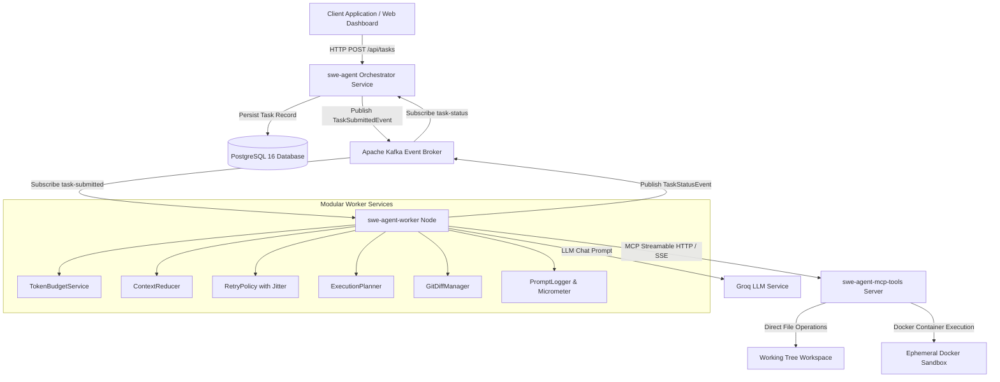

# Autonomous SWE Agent Platform: System Architecture

## Architecture Overview

The Autonomous SWE Agent Platform is an event-driven, microservice-based AI system engineered for automated software engineering task execution. 

---

## Component Breakdown

### 1. Orchestrator Gateway Service (`swe-agent`)
- **Port**: 8080
- **Responsibilities**: Serves as the public REST API entry point. Receives task requests, validates repo paths, persists `TaskRecord` state into PostgreSQL, dispatches `TaskSubmittedEvent` messages to Kafka, and listens to status updates for live state tracking.

### 2. Autonomous Worker Node (`swe-agent-worker`)
- **Port**: 8082
- **Responsibilities**: Stateless Kafka consumer executing the Spring AI agentic loop. Modularized into focused services:
  - **`TokenBudgetService`**: Computes prompt/completion token usage and safety margins.
  - **`ContextReducer`**: Manages rolling conversation history and generates reasoning summaries.
  - **`RetryPolicy`**: Applies exponential backoff ($2^{\text{attempt}-1} \times 2\text{s}$) with random jitter ($\pm 25\%$).
  - **`ExecutionPlanner`**: Coordinates state transitions (`PLANNING` $\rightarrow$ `CODING` $\rightarrow$ `TESTING`).
  - **`GitDiffManager`**: Executes git diff queries.
  - **`PromptLogger`**: Exports Micrometer metrics (`swe_agent_input_tokens_total`, `swe_agent_output_tokens_total`).

### 3. Model Context Protocol Server (`swe-agent-mcp-tools`)
- **Port**: 8081
- **Responsibilities**: Standalone Spring AI MCP Server implementing filesystem exploration, patch application, and Docker sandbox command execution.

### 4. Ephemeral Docker Sandbox
- **Image**: `maven:3.9-eclipse-temurin-17`
- **Responsibilities**: Provides an isolated, ephemeral runtime environment mounted to the repository workspace to run `mvn test` without altering the host machine.
