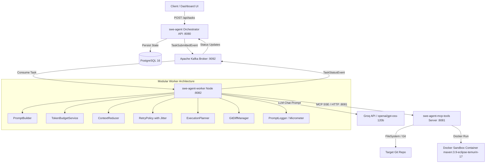

# Autonomous SWE Agent Platform


An enterprise-grade, event-driven Autonomous Software Engineering Agent built with Java 21, Spring Boot, Spring AI, Groq LLMs, Model Context Protocol (MCP) tool server, Apache Kafka, PostgreSQL, and sandboxed Docker containers.

---

## Table of Contents
- [Overview](#overview)
- [System Architecture](#system-architecture)
- [Key Features](#key-features)
- [Technology Stack](#technology-stack)
- [Directory & Repository Structure](#directory--repository-structure)
- [Environment Variables](#environment-variables)
- [Quick Start & Local Setup](#quick-start--local-setup)
- [Agentic MCP Workflow](#agentic-mcp-workflow)
- [API Endpoints](#api-endpoints)
- [Token Budgeting & Context Reduction](#token-budgeting--context-reduction)
- [Security Features](#security-features)
- [Testing & Quality Verification](#testing--quality-verification)
- [Documentation Index](#documentation-index)
- [License](#license)

---

## Overview

The Autonomous SWE Agent automatically receives issue descriptions and code repository paths, plans code repairs using LLMs, explores codebases through MCP tools (`list_directory`, `read_file`), applies modifications (`write_file`), verifies fixes by executing tests in isolated Docker sandboxes (`run_in_sandbox`), self-corrects on test failure, and generates clean `git diff` patches.

---

## System Architecture



---

## Key Features

- **Decoupled Event-Driven Microservices**: Async Kafka task dispatching and status streaming with Dead Letter Queue (DLQ) support.
- **Model Context Protocol (MCP)**: Native integration via Spring AI MCP Client supporting tool-first agent loops.
- **Token Budgeting & Context Compression**: Automatic token estimation with a 10% safety margin. Compresses history into structured reasoning summaries when context exceeds budget.
- **Resilient Exponential Backoff**: Exponential retries ($2^{\text{attempt}-1} \times 2\text{s}$) with $\pm 25\%$ random jitter and `Retry-After` header extraction for HTTP 429 / 503 errors.
- **Sandboxed Container Execution**: Automated test execution in ephemeral Docker containers (`maven:3.9-eclipse-temurin-17`).
- **Security Hardened**: Command injection protections blocking unauthorized shell operators and enforcing strict repository path escaping.

---

## Technology Stack

- **Core Framework**: Java 21, Spring Boot 3.3.5
- **AI Orchestration**: Spring AI 1.0.0, Groq API (`openai/gpt-oss-120b`)
- **Protocol**: Model Context Protocol (MCP) Streamable HTTP & SSE
- **Event Streaming**: Apache Kafka (Kafka Streams & JSON Serializers)
- **Database**: PostgreSQL 16 with Spring Data JPA
- **Containerization**: Docker, Docker Compose
- **Metrics**: Micrometer Prometheus Registry
- **Testing**: JUnit 5, AssertJ, Mockito

---

## Directory & Repository Structure

```
.
├── src/
│   ├── main/java/com/example/sweagent/
│   │   ├── config/          # Web & Security Configuration
│   │   ├── controller/      # REST API Controllers (TaskController, PatchController)
│   │   ├── dto/             # Request/Response Data Transfer Objects
│   │   ├── exception/       # Global Exception Handlers
│   │   ├── model/           # JPA Entities (TaskRecord)
│   │   ├── repository/      # JPA Repositories (TaskRepository)
│   │   └── service/         # TaskOrchestratorService & PatchService
│   └── test/java/com/example/sweagent/
│       └── service/         # Unit Tests (TaskOrchestratorServiceTest)
├── Dockerfile               # Multi-stage container build
├── pom.xml                  # Maven POM dependencies
└── README.md                # Master README
```

---

## Environment Variables

| Variable | Default Value | Description |
| :--- | :--- | :--- |
| `GROQ_API_KEY` | *(Required)* | API Key for Groq LLM services |
| `GROQ_MODEL` | `openai/gpt-oss-120b` | Target LLM model identifier |
| `DB_HOST` | `postgres` | PostgreSQL hostname |
| `DB_PORT` | `5432` | PostgreSQL port |
| `DB_NAME` | `sweagent` | PostgreSQL database name |
| `DB_USER` | `sweagent` | Database username |
| `DB_PASS` | `sweagent` | Database password |
| `SPRING_KAFKA_BOOTSTRAP_SERVERS` | `localhost:9092` | Kafka broker bootstrap servers |

---

## Quick Start & Local Setup

### Prerequisites
- JDK 21+
- Maven 3.9+
- Docker & Docker Compose
- Groq API Key

### Running with Docker Compose
```bash
# Set your Groq API Key
export GROQ_API_KEY="your_groq_api_key_here"

# Start the full stack
docker compose -f docker-compose.yml up --build -d
```

---

## Agentic MCP Workflow

The agent adheres strictly to the tool-first workflow:

```
User Task Description
        ↓
    list_directory (Explore codebase structure)
        ↓
    LLM selects relevant files
        ↓
    read_file (Inspect source code)
        ↓
    LLM Reasons & Generates Plan
        ↓
    write_file (Apply patch in-place)
        ↓
    run_in_sandbox (Execute 'mvn test' inside Docker)
        ↓
    [Self-Correct if tests fail up to 3 attempts]
        ↓
    git_diff (Inspect final uncommitted patch)
        ↓
    Task Completed & Status Published
```

---

## API Endpoints

### 1. Submit New Task
`POST /api/tasks`
```json
{
  "repoPath": "C:\\projects\\my-app",
  "issueDescription": "Fix NullPointerException in CalculatorService.java"
}
```
**Response (`202 Accepted`)**:
```json
{
  "taskId": "c6183508-9ce6-4017-864b-84ae14a7afdc",
  "status": "PENDING"
}
```

### 2. Get Task Status
`GET /api/tasks/{taskId}`
**Response (`200 OK`)**:
```json
{
  "taskId": "c6183508-9ce6-4017-864b-84ae14a7afdc",
  "repoPath": "C:\\projects\\my-app",
  "issueDescription": "Fix NullPointerException in CalculatorService.java",
  "currentStatus": "COMPLETED",
  "summary": "Task completed successfully. Executed 4 tool calls.",
  "gitDiff": "diff --git a/Calculator.java...",
  "finalTestResult": "BUILD SUCCESS",
  "attemptsMade": 1
}
```

---

## Documentation Index

- 📘 [ARCHITECTURE.md](file:///c:/Users/ANOOP/Desktop/projects/autonomus%20agent/ARCHITECTURE.md) — Complete System Architecture & Service Decomposition.
- 🚀 [DEPLOYMENT.md](file:///c:/Users/ANOOP/Desktop/projects/autonomus%20agent/DEPLOYMENT.md) — Production Deployment Guide for Docker, Render, and Vercel.
- 🤝 [CONTRIBUTING.md](file:///c:/Users/ANOOP/Desktop/projects/autonomus%20agent/CONTRIBUTING.md) — Guidelines for Open-Source Contributions.
- 📜 [CHANGELOG.md](file:///c:/Users/ANOOP/Desktop/projects/autonomus%20agent/CHANGELOG.md) — Release Notes & Version History.
- 🔌 [API.md](file:///c:/Users/ANOOP/Desktop/projects/autonomus%20agent/API.md) — Comprehensive OpenAPI/REST API Reference.
- 🛡️ [SECURITY.md](file:///c:/Users/ANOOP/Desktop/projects/autonomus%20agent/SECURITY.md) — Security Architecture & Sandbox Isolation Policy.

---

## License

Distributed under the MIT License. See `LICENSE` for details.
